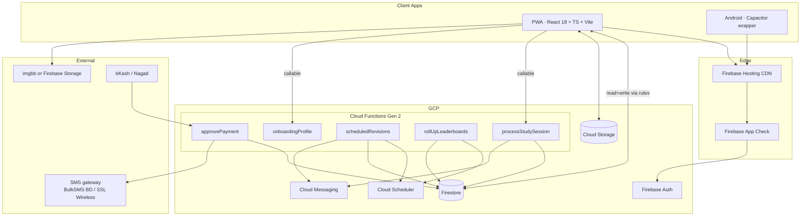

# Design Spec — "HSC Crackers" Study Tracker (Our Build)

**Date:** 2026-07-29
**Status:** Draft v1
**Author:** Distilled from analysis of `study-tracker-hsc.web.app` (analyzed in this session) + user requirements

---

## 0. Why this spec exists

The existing `study-tracker-hsc.web.app` is a working, localized HSC study tracker built on vanilla JS modules + Firebase Hosting. We are **not** forking it; we are building a **clean-room re-implementation** that:

1. Keeps the **core flow** that already works (timer, syllabus map, pace card, leaderboard, bKash payment review, Bangla-first UI).
2. Fixes the structural weaknesses (no tests, no build, single 1000-line controller, client-side trust boundaries, no PWA).
3. Adds a small number of **differentiating features** so the product can be sold.
4. Targets a **modern, polished UI** that visibly out-classes the original.
5. Uses an **all-free** technology budget (no paid SaaS tiers, no credit card on the platform account).

> **Naming & branding note:** We are NOT keeping the original's "HSC CRACKERS" name or its acid-lime + dark graphite palette — those are its brand identity and using them risks customer confusion / brand collision. The visual identity below is fresh.

---

## 1. Product goals (MVP that we will actually ship)

### 1.1 Target user
- **Primary:** Bangladeshi HSC (Class 11–12) students preparing for the national exam.
- **Secondary:** Coaching institutes who buy seats for their students.
- **Languages:** Bangla (default) + English, fully switchable.

### 1.2 Value proposition
- A **focus timer that cannot be cheated** (server-validated sessions, attention checks).
- A **personalized syllabus map** (NCTB HSC 1st & 2nd year, Bangla + English medium) with **automatic spaced-repetition scheduling**.
- A **pace-vs-actual forecast** that tells you, today, whether you'll finish in time.
- **Community leaderboard** (daily + monthly, batch-scoped) for accountability.
- **Offline-capable PWA** (works on patchy 3G) and a **Capacitor Android app** for installs.

### 1.3 Monetization (single paid tier)
- **7-day free trial** — full feature access, no card needed.
- **Pro:** ৳50/month or ৳500/year — same as the original, no surprise pricing.
- **No ads.** Ever.
- **B2B add-on (post-MVP):** Coaching Institute plan ৳500/month for 30 student seats + admin dashboard.

### 1.4 Out of scope for v1
- iOS native (Android first, iOS later via Capacitor).
- Mock-test / MCQ engine.
- AI tutor / LLM features.
- Multi-cohort analytics dashboards (B2B add-on later).

---

## 2. Tech stack (all free, no credit card required to start)

### 2.1 Decision summary

| Layer | Choice | Free-tier notes |
|---|---|---|
| Language | **TypeScript (strict)** | — |
| Framework | **React 18 + React Router 6** | — |
| Build | **Vite** | — |
| Styling | **Tailwind CSS + shadcn/ui** | All OSS, MIT licensed. |
| State | **Zustand** (per-feature stores) + **TanStack Query** (server cache) | — |
| Forms | **react-hook-form + Zod** | — |
| Charts | **Recharts** | — |
| Animations | **Framer Motion** (entry/exit) + **Lottie React** (chapter check-in) | — |
| Icons | **Lucide React** | — |
| Backend | **Firebase Auth + Firestore + Cloud Functions + Cloud Storage + FCM** | Stay on Firebase. We use **Spark (free)** for the first ~500 students. Once we add Cloud Functions we move to **Blaze with a $5/mo billing alert** — but no card is needed to *start*. The Cloud Function call volume at <1k students fits inside Blaze's 2M free invocations/month. (Supabase's project auto-pause and Appwrite's 1-week inactivity pause are disqualifying for an "always-there" study tool.) |
| Payments | **bKash / Nagad screenshot → Firebase Storage (signed URL) → admin review**, with a forward path to a payment aggregator webhook (SSL Wireless first, bKash Payment API as a later option) | Both aggregators are pay-per-SMS at low volume, paid out of revenue. |
| Background jobs | **Cloud Functions + Cloud Scheduler** | — |
| Mobile wrapper (post-v1) | **Capacitor** (Android first) | OSS. |
| Testing | **Vitest + React Testing Library + Playwright** + **@firebase/rules-unit-testing** | — |
| Lint/format | **ESLint + Prettier + Husky + lint-staged** | — |
| CI/CD | **GitHub Actions (free for public repos, 2k min/mo for private)** → Firebase Hosting preview channels | — |
| Observability | **Sentry (free 5K events/mo)** + Firebase Analytics + Performance Monitoring | — |
| Error monitoring budget | Sentry free tier caps at 5K events/mo — at <1k students this is plenty; above that we self-host GlitchTip on a free Fly.io hobby plan as a drop-in replacement. | — |

### 2.2 What we explicitly AVOID paying for
- No Vercel/Netlify Pro.
- No Algolia/Typesense (Firestore search is enough for v1).
- No Cloudflare Pro (Firebase Hosting CDN is sufficient for our geography; Cloudflare free tier is on standby if we need to add a custom domain with a worker).
- No Twilio (use SSL Wireless or BulkSMS BD; cheaper in Bangladesh).
- No paid chart libraries, UI kits, or icon sets.

### 2.3 What we'll add once we have revenue
- Move Sentry to a paid plan OR self-host.
- Switch SMS to Twilio if BD providers become unreliable.
- Add Cloudflare in front of Firebase Hosting for WAF + edge caching.
- bKash Payment API integration (replaces manual screenshot review).

---

## 3. High-level architecture



### 3.1 Project structure

```
apps/
  web/                           # PWA
    src/
      app/                       # router, providers, error boundary
      features/
        auth/                    # Google sign-in, profile setup
        timer/                   # FocusTimer, presence, session log
        syllabus/                # Subject/chapter data + map UI
        tasks/                   # Upcoming + auto-scheduled revisions
        progress/                # Pace, completion, forecast
        leaderboard/             # Community + batch ranks
        subscription/            # Plans, payment proof, status
        notifications/           # FCM opt-in, in-app inbox
        admin/                   # Admin dashboard (gated)
      components/                # Shared UI (Button, Modal, Pill, Card, ChartCard)
      lib/
        firebase/                # init, typed wrappers
        time/                    # BST math, midnight split
        analytics/               # Sentry, Firebase events
      stores/                    # Zustand slices
      hooks/                     # useAuth, useProfile, useSubscription
      styles/                    # tailwind, theme tokens
    public/
    tests/
  functions/                     # Firebase Functions (TS)
    src/
      processStudySession/
      approvePayment/
      scheduledRevisions/
      rollUpLeaderboards/
  packages/
  capacitor/                     # Android wrapper
```

---

## 4. Data model (Firestore)

```
/users/{uid}
  displayName, photoURL, email, phone,
  college,
  batchId,                                       // e.g. 'HSC-2026', see §11
  medium: 'bangla'|'english',
  timezone: 'Asia/Dhaka',
  trialEnd: Timestamp,                           // server-set
  subscription: {                                // server-only writes
    status: 'trial'|'active'|'expired'|'pending',
    plan: 'monthly'|'yearly',
    expiresAt: Timestamp,
    paymentRequestId: string
  },
  fcmTokens: { [token]: true },
  createdAt, updatedAt

/users/{uid}/syllabus/{subjectId}                   // one doc per subject
  subjectId, subjectName,
  chapters: {
    [chapterName]: {
      firstStudy: bool, firstStudyDate,
      firstRevision: bool, firstRevisionDate,
      secondRevision: bool, secondRevisionDate,
      thirdRevision: bool, thirdRevisionDate
    }
  },
  updatedAt

/users/{uid}/sessions/{sessionId}                   // written ONLY by FN1
  startedAtMs, endedAtMs, durationSec,
  date: 'YYYY-MM-DD' (BST),
  presenceChecks: number,                           // how many popups confirmed
  device: { ua, platform },
  createdAt                                        // serverTimestamp

/users/{uid}/upcomingTasks/{taskId}
  subjectId, subjectName, chapterName, type,
  source: 'manual'|'auto-sr',
  scheduledFor: Timestamp,                          // for notifications
  status: 'pending'|'done'|'skipped',
  createdAt, resolvedAt

/users/{uid}/meta/trackedSubjects
  subjectIds: string[]

/users/{uid}/meta/settings
  notifications: { revisions: bool, streakGuard: bool, leaderboardOptIn: bool },
  theme: 'dark'|'light'|'auto'

/paymentRequests/{reqId}
  uid, planMonths, planPrice, trx,
  screenshotUrl, screenshotPath,                    // Firebase Storage
  status: 'pending'|'approved'|'rejected',
  reviewedBy: uid, reviewedAt,
  createdAt

/analytics/leaderboard_daily/{YYYY-MM-DD}
  totalDurationSec, activeUserCount, topRecordSec,
  top10: [{ uid, name, photoURL, college, durationSec }],
  users: { [uid]: durationSec }

/analytics/leaderboard_monthly/{YYYY-MM}
  // same shape

/batches/{batchId}                                // e.g. "HSC-2026"
  label: 'HSC 2026',                              // human display
  collegeStart: Timestamp,
  examStart: Timestamp,
  examEnd: Timestamp,                             // last exam day
  resultDate: Timestamp,                          // for post-exam state
  medium: 'bangla'|'english'|'both',
  status: 'pre-start'|'in-session'|'exam-window'|'resulted',
  isPublic: bool,                                 // shown in onboarding picker
  createdBy: uid, createdAt, updatedAt

/syllabus/{board}/{medium}/{subjectId}             // GLOBAL, server-authored
  name, chapters: [{ id, name, tags? }]

/admins/{uid}                                      // RBAC
  role: 'super'|'reviewer'|'analyst',
  scopes: { batches: [hscBatch], orgs?: [] }

/audit/{id}                                        // append-only
  actor, action, target, before, after, at
```

---

## 5. Security model

### 5.1 Trust boundaries
- **Client is untrusted** for: subscription status, trialEnd, leaderboard writes, session writes.
- **Client is trusted** for: timer tick (we still verify server-side), UI preferences, "I finished this chapter" (but with rate limits + idempotency).
- **Server is the only writer** of `subscription`, `trialEnd`, `users/{uid}/sessions`, `/analytics/*`.

### 5.2 Firestore rules (essentials)
```ts
match /users/{uid} {
  allow read: if request.auth.uid == uid || isAdmin();
  allow create: if request.auth.uid == uid
                && onlyFields(['displayName','email','photoURL','college','hscBatch','medium']);
  allow update: if request.auth.uid == uid
                && !request.resource.data.diff(resource.data).affectedKeys()
                    .hasAny(['trialEnd','subscription','createdAt']);
  match /sessions/{sid} { allow read, write: if false; }  // server-only
  match /syllabus/{x}    { allow read, write: if request.auth.uid == uid; }
  match /upcomingTasks/{x}{ allow read, write: if request.auth.uid == uid; }
  match /meta/{x}        { allow read, write: if request.auth.uid == uid; }
}
match /paymentRequests/{id} {
  allow read: if request.auth != null && resource.data.uid == request.auth.uid;
  allow create: if request.auth != null && request.resource.data.uid == request.auth.uid;
  allow update, delete: if false;
}
match /analytics/{x}   { allow read: if request.auth != null; allow write: if false; }
match /admins/{uid}    { allow read: if request.auth != null; allow write: if false; }
```

### 5.3 Anti-cheat (focus timer)
1. Client posts **attention pings** every 30s while running (heartbeat).
2. Server issues a **random 60s nonce** every 5–15 min. Client must echo it back before the deadline.
3. Session is **rejected** if:
   - durationSec > 6h,
   - more than 2 missed nonces,
   - overlap with prior session (server maintains last `endedAtMs`),
   - daily count > 10.
4. Wake Lock + visibility remain client-side **hints**, not trust.

### 5.4 App Check
- Enforce **Firebase App Check (reCAPTCHA Enterprise)** on Auth + Functions. Reject all traffic without a valid token.

### 5.5 Secrets
- All keys via `.env` (Vite) → never committed. CI injects per-environment.
- `imgbb` key replaced with **Firebase Storage signed-upload URLs** generated by a Cloud Function — the client never sees a global key.

---

## 6. UI / UX

### 6.1 Design language

**Palette — "Cool Slate" (chosen for focus, not the original's acid-lime).** Muted steel blue + warm sand. Blue tones lower heart rate and screen-time eye strain; warm amber gives a single high-energy signal color without becoming a wash. Both modes are tuned for ≥2h screen time.

| Token | Light | Dark |
|---|---|---|
| `--bg` | `#F4F1EC` | `#0F1620` |
| `--surface` | `#FFFFFF` | `#172030` |
| `--surface-2` | `#ECE7DE` | `#1E293B` |
| `--text` | `#1B2A41` | `#E6EAF0` |
| `--text-dim` | `#5C6B7E` | `#94A3B8` |
| `--primary` (focus blue) | `#2E5A88` | `#6B9BD1` |
| `--accent` (signal amber) | `#E0A458` | `#E0A458` |
| `--success` | `#3F6B4E` | `#7FB48E` |
| `--warning` | `#C97B5A` | `#D69472` |
| `--danger` | `#B33A3A` | `#E16A6A` |

Palette is exposed as Tailwind theme tokens + CSS variables so dark/light flip is one `class` on `<html>`.

- **Typography:**
  - **Latin:** "Plus Jakarta Sans" (UI) + "Space Grotesk" (headings).
  - **Bangla:** "Hind Siliguri" (UI) + "Noto Sans Bengali" (headings).
  - Loaded via `@fontsource/*` (self-hosted, no Google CDN dependency).
- **Spacing scale:** 4-pt grid (Tailwind defaults).
- **Motion:** Subtle (Framer Motion for hero/banner, Lottie for chapter check-in). No bouncy UI; we're a study app, not a game. Respect `prefers-reduced-motion`.
- **Accessibility:** WCAG 2.1 AA, focus rings, keyboard nav, screen reader labels, reduced-motion respect, all colour contrasts ≥ 4.5:1 against `--bg`.

### 6.2 Screen map
```
/                       → marketing + login (Google)
/onboarding             → first-time: pick medium (Bangla/English) + batch (HSC-2026 … HSC-2030) + college
/app                    → main SPA shell
  /app                  → Overview (today's stats, pace card, exam countdown, community rank)
  /app/study            → Focus mode (timer, chapter tag picker, live presence)
  /app/syllabus         → Subject tabs + 4-checkbox grid + add-task
  /app/syllabus/:id     → deep-link to a subject
  /app/tasks            → Upcoming + auto-scheduled revisions
  /app/progress         → Pace, forecast, leaderboards
  /app/subscribe        → Plans, payment proof, history
  /app/settings         → Profile, notifications, language, theme
/admin                  → admin shell (gated)
  /admin/approvals      → paymentRequests queue
  /admin/leaderboards   → cohort analytics
  /admin/audit          → action log
```

### 6.3 What "more good looking than the current version" actually means
- **Hero pace card** on Overview uses a radial/arc progress (Recharts `<RadialBarChart>`), not a flat bar, with a live "**N days to HSC exam**" countdown. Pre-exam / in-window / post-exam states have different colors and copy.
- **Subject map** is a 2-column responsive grid with animated check-ins (Lottie) and a per-chapter "next review in N days" hint.
- **Timer** is a full-bleed focus mode with a circular SVG ring, dimmed everything else, gentle breathing animation. **Timer does NOT pause on tab-switch or minimize** (see §8.1).
- **Streaks** get a flame that **visibly changes intensity** with streak length (1–3 / 4–10 / 11–30 / 30+).
- **Bangla font** is real Noto Sans Bengali, not a web fallback.
- **Microcopy** is reviewed by a Bangladeshi student to feel native, not Google-Translated.

### 6.4 Onboarding language
- Step 1 of onboarding asks **"আপনার মাধ্যম কী?" / "What's your medium?"** → Bangla Medium or English Medium. This sets `users.medium` and which `/syllabus/{medium}` document is shown.
- Step 2 asks **"আপনার ব্যাচ?" / "Which batch?"** → HSC 2026 … HSC 2030. This sets `users.batchId` and which `/batches/{batchId}` document drives the pace card.
- Step 3 is the college name.

---

## 7. Feature breakdown (what makes the v1 different)

### 7.1 Core (parity with original)
- Google sign-in + profile setup (college, batch, medium).
- Focus timer with presence checks, daily cap, overlap guard, BST midnight split.
- Syllabus map (4-stage checkboxes per chapter), subject selection.
- Upcoming tasks (manual) + completion that updates the syllabus map.
- Progress: today's hours, week, streak, 1st-study %, 1st/2nd/3rd revision %.
- Pace card: actual % vs calendar elapsed %, target daily minutes.
- Community leaderboard: daily + monthly, with rank gate (15 min/day).
- Subscription: 7-day trial, ৳50/mo, manual payment review.

### 7.2 Differentiators (the "sell" features)
- **Spaced-repetition auto-scheduler.** Mark a chapter as "1st Study done" → Cloud Function `scheduledRevisions` automatically creates `upcomingTasks` for 1st Rev (+7d), 2nd Rev (+14d), 3rd Rev (+30d). FCM notification on the day.
- **Per-chapter session tagging.** Timer has a "what are you studying?" dropdown. Sessions roll up to chapter level so progress is granular.
- **Forecast.** "At your current pace, you'll finish HSC syllabus on **Aug 14** — exam is **Jul 22**. To catch up, study **3h 20m/day** instead of 1h 10m/day."
- **PWA + offline timer.** Start a focus session with no network, sync when back online.
- **Multi-language UI.** BN/EN switch with translated content (not just labels).
- **Notification preferences.** Per-channel opt-in (revisions, streak guard, weekly report).
- **Audit log.** Every admin action is logged and viewable.
- **Data export.** One-click download of all your data as JSON.

### 7.3 Admin
- Payment request queue with screenshot viewer, approve/reject, automatic SMS to student.
- Cohort dashboard: per-batch completion %, avg hours, top students.
- Audit log viewer.
- Role-based access (super / reviewer / analyst).

### 7.4 Gamification: time-blocking + daily plan
- **Daily Plan (প্রতিদিনের পরিকল্পনা).** Each morning (or at first open of the day) the app suggests a plan: "Study Physics Ch. 3 (1st Study) for 1h, then Bangla 2nd Paper grammar for 30m, then 3 × 25m Pomodoros on ICT Ch. 4." Built from the user's pending `upcomingTasks` + their own preference.
- **Time-blocking.** In addition to the timer, students can drag blocks onto a day timeline. A block is a planned study session (subject, chapter, duration). If the block ends and the student has not started a matching session, the system flags it. Visible at-a-glance on Overview: "**2 of 4 planned blocks completed today**."
- **Streak guard.** If a planned day is fully missed, the streak breaks visibly with a soft "Hey, you can still save tomorrow." tone — never shame.
- **WhatsApp daily digest (post-MVP for v1.0, full v1.1).** A Cloud Function runs at 21:00 BST, looks at the user's last 24h, and sends one WhatsApp message via the WhatsApp Cloud API (free tier: 1,000 service conversations/month) — or via a Bangladesh-friendly provider if WhatsApp is gated. The digest is opt-in. Parents can be added as CCs (with the student's consent). Content: today's hours, blocks completed, pace delta, tomorrow's plan. **Out of v1.0 if the WhatsApp Business verification isn't done in time; replace with an FCM + email digest fallback.**

### 7.5 Per-chapter session tagging
- Timer has a subject + chapter dropdown. Sessions are tagged. A separate `users/{uid}/chapterStats/{chapterId}` doc rolls up time-on-chapter so the syllabus map can show "Spent 1h 12m on this chapter."

---

## 8. Cloud Functions (essentials)

| Function | Trigger | Responsibility |
|---|---|---|
| `onboardingProfile` | `Auth onCreate` | Create `/users/{uid}` with trialEnd = now + 7d, set `batchId` and `medium` from onboarding claim. |
| `processStudySession` | `callable` | Validate (duration, overlap, presence nonces, daily cap), write `users/{uid}/sessions/{sid}`, update daily leaderboard, roll up `users/{uid}/chapterStats/{chapterId}`, return sanitized result. |
| `scheduledRevisions` | (a) write-trigger on `users/{uid}/syllabus` when `firstStudyDate` set; (b) daily cron to enqueue due notifications | Create `upcomingTasks` and send FCM. |
| `rollUpLeaderboards` | Cloud Scheduler, hourly | Roll daily → monthly leaderboards, prune `users` map after 30 days. |
| `approvePayment` | callable (admin) | Set `users.subscription.status='active'`, set `expiresAt`, write `audit`, send SMS. |
| `generateSignedUploadUrl` | callable | Return a one-time Firebase Storage URL for screenshots. |
| `forecastProgress` | callable | Compute pace forecast for a given uid/batch using current 30-day rolling average. |
| `generateDailyPlan` | daily cron at 05:00 BST | For each user, build a suggested plan from pending `upcomingTasks` + last-week pace; persist to `users/{uid}/meta/dailyPlan`. |
| `enqueueDailyDigest` | Cloud Scheduler at 21:00 BST | Send WhatsApp / FCM / email digest (opt-in). Falls back gracefully if WhatsApp creds are not yet verified. |
| `recomputeBatchStatus` | daily cron at 00:00 BST | For every public batch, set `status` to `pre-start`/`in-session`/`exam-window`/`resulted` based on today vs the batch's dates. |

---

## 9. Batch system (HSC 2026 … HSC 2030)

### 9.1 Why batches live in Firestore, not in code
Hard-coded `const HSC26_START = '2024-07-15'` is brittle: dates shift every year (COVID pushed HSC 2021 to December), the Ministry sometimes extends the college year, and adding HSC 2031 means a code deploy. Storing each batch as a Firestore document lets admins add / edit / pause batches without a release.

### 9.2 Document ID format
`HSC-YYYY` (kebab-style, e.g. `HSC-2026`). Always include the 4-digit year. **Never** use `HSC26` (collides with old string-comparisons, breaks URL/log parsing, and forces regex on every read).

### 9.3 Per-batch document
```ts
/batches/{batchId} {
  label: 'HSC 2026',
  collegeStart: Timestamp,
  examStart: Timestamp,
  examEnd: Timestamp,
  resultDate: Timestamp,
  medium: 'bangla' | 'english' | 'both',
  status: 'pre-start' | 'in-session' | 'exam-window' | 'resulted',
  isPublic: boolean,           // shown in onboarding picker
  createdBy: uid,
  createdAt, updatedAt
}
```

### 9.4 Seed data (placeholder, **verify with Bangladesh Education Board before launch**)
| batchId | collegeStart | examStart | examEnd | resultDate | status (today: 2026-07-29) |
|---|---|---|---|---|---|
| `HSC-2024` | 2023-07-15 | 2024-06-30 | 2024-08-15 | 2024-10-15 | resulted |
| `HSC-2025` | 2024-07-15 | 2025-06-30 | 2025-08-15 | 2025-10-15 | resulted |
| `HSC-2026` | 2025-07-15 | 2026-06-30 | 2026-08-15 | 2026-10-15 | exam-window |
| `HSC-2027` | 2026-07-15 | 2027-06-30 | 2027-08-15 | 2027-10-15 | pre-start |
| `HSC-2028` | 2027-07-15 | 2028-06-30 | 2028-08-15 | 2028-10-15 | pre-start |
| `HSC-2029` | 2028-07-15 | 2029-06-30 | 2029-08-15 | 2029-10-15 | pre-start |
| `HSC-2030` | 2029-07-15 | 2030-06-30 | 2030-08-15 | 2030-10-15 | pre-start |

> These are **typical mid-year patterns, unverified against the official board schedule**. Admin must confirm and edit in the admin dashboard before public launch.

### 9.5 Pace calculation
For a user with `batchId = HSC-YYYY` and `now` in `Asia/Dhaka`:
- `totalDays = (examStart - collegeStart) in days`
- `elapsedDays = clamp(now - collegeStart, 0, totalDays)`
- `pacePct = round(elapsedDays / totalDays * 100)`
- `remainingDays = max((examStart - now) in days, 0)`
- `forecastFinishDate` is computed from current 30-day average + remaining syllabus work.
- `daysToExam` is the same as `remainingDays` when `status === 'in-session'`, and `0` after `examStart`.

The pace card has 4 states: pre-start (countdown to college start), in-session (countdown to exam), exam-window (countdown to last exam), resulted (celebratory card).

### 9.6 Switching batches
A user can change `batchId` from Settings. Their `syllabus/*` and `sessions/*` carry over (they're not batch-scoped). A history of past `batchId` is kept in `users/{uid}.batchHistory[]` for analytics.

### 9.7 Admin CRUD
Only admins can `create/update/delete` `/batches/{batchId}`. A simple form in the admin dashboard.

### 9.8 Failure modes this design prevents
- Stale hard-coded dates after the board shifts the calendar.
- "HSC 2026 vs HSC 27" string-collision bugs.
- Cross-batch data pollution (a HSC-2025 student accidentally seeing HSC-2026 leaderboard data).
- Timezone drift (every date is a Firestore Timestamp + a `timezone: 'Asia/Dhaka'` field on the user doc).

---

## 10. Focus timer that does NOT pause on tab-switch / minimize

### 10.1 The bug we're fixing
The original app calls `pauseAndNotify()` on `visibilitychange → hidden` and on `window.blur`. This is **wrong for our use case**: Bangladeshi students often attend online classes (Zoom, Google Meet) in a separate tab while the timer runs. The timer must keep counting accurately.

### 10.2 What the web actually allows
- **No web standard lets a page execute JS while minimized.** Chrome 88+ throttles hidden tabs: minimal → standard (1 check/sec for 5 min) → intensive (1 check/min after 5 min hidden with ≥5 chained timers). `setInterval` and `requestAnimationFrame` are both affected.
- The original's `pauseAndNotify` reaction is therefore too aggressive — students lose real study time.

### 10.3 Our approach
**Truth source = `Date.now()` deltas, not setInterval tick counts.**

1. On `Start`, store `startTs = Date.now()` and `pausedAccumMs = 0`. Persist these to Firestore (`users/{uid}/activeSession/current`) and `localStorage`.
2. On every render (including the 1Hz tick), compute `elapsed = (now - startTs) - pausedAccumMs`. This is exact regardless of throttling.
3. `visibilitychange` and `blur` events **do nothing** to the timer state. They only re-render the UI from the (already-correct) elapsed value and reset the tick interval when the tab becomes visible again (to avoid a long catch-up render).
4. **Pause** is a deliberate user action only (button or ⌘/Ctrl+P keyboard shortcut).
5. **Server-anchored time.** When the client calls `processStudySession`, the server uses its own `Date.now()` and `serverStartTs` (set on session start via a lightweight `sessionStart` callable) to verify the duration. Client clock drift is caught.
6. **Offline support.** If Firestore writes are offline, the session record is queued in IndexedDB and replayed via the Background Sync API on reconnect.
7. **Anti-cheat** moves entirely server-side (presence nonces, overlap check, daily cap) — see §5.3.

### 10.4 Why this is safe
- The timer can never "over-count" — `Date.now()` is monotonic.
- It can never lose time to throttling — we don't depend on tick count.
- It survives tab-switch, minimize, screen lock, even device sleep → wake (as long as the page wasn't killed).
- If the page **is** killed (mobile OS reclaims memory), the persisted `startTs` in Firestore + a foreground re-validation on next load lets the user resume the session up to a configurable grace period (e.g. 10 min).

### 10.5 Anti-cheat still works
- Presence nonce popup: fires on a setTimeout inside the main thread. If the user switches tabs during the popup, the popup's own `confirmPresenceBtn` is what matters — but the popup is suppressed for hidden tabs (no fake confirmation possible) AND the nonce is server-validated, so a tampered client can't forge it.
- Daily cap and overlap: server checks.
- 6-hour cap: server checks.

### 10.6 UX nicety
When the user comes back to a hidden tab, the UI briefly shows "Welcome back — your session is still running. **42 min elapsed.**" so the absence-then-presence feels intentional, not bugged.

- **Unit (Vitest):** BST midnight split, pace math, overlap detection, access resolver, SR scheduler.
- **Component (RTL):** every screen has at least one render test.
- **Integration (Vitest + firebase-rules-unit-testing):** every Firestore rule has positive + negative tests.
- **E2E (Playwright):** sign-in → onboarding → first session → first task → see progress. Subscribe happy path + reject path.
- **Load test (k6):** 5k concurrent sessions writing through `processStudySession`.

Target coverage: **80% lines** on `lib/` and `features/`. UI coverage is best-effort, not gated.

---

## 11. Rollout & milestones (v1 = "Full vision")

> User chose "Full vision" — but the **MVP** we ship in v1 is the original-feature set **plus the differentiators**, **not** the B2B coaching plan. The coaching plan is a v2 add-on. WhatsApp digest is **deferred to v1.1** because WABA verification takes weeks; v1.0 uses FCM + email.

### Milestone 1 — Skeleton (week 1–2)
- Vite + React + TS + Tailwind + shadcn/ui + ESLint + Prettier + Husky.
- "Cool Slate" palette tokens + dark/light theme switcher.
- Firebase project created (separate from the original), App Check enabled, rules deployed.
- CI on GitHub Actions: lint + test + preview deploy.

### Milestone 2 — Auth + profile (week 2–3)
- Google sign-in.
- Onboarding flow: medium (Bangla/English) → batch (HSC-2026 … HSC-2030) → college name.
- `requireAuth` + `requireProfile` route guards.
- Batch CRUD seed (`/batches/HSC-2024 … HSC-2030`) + `recomputeBatchStatus` cron.

### Milestone 3 — Syllabus + tasks (week 3–5)
- Seed `/syllabus/bangla/...` and `/syllabus/english/...` from the original data, **re-authored** (we re-type it, not scrape).
- Subject selection, syllabus map, manual tasks, completion wiring.
- Spaced-repetition auto-scheduler (writes `upcomingTasks` on `firstStudyDate` set).

### Milestone 4 — Timer that doesn't pause (week 5–7)
- `Date.now()`-anchored timer with Firestore + localStorage persistence.
- `processStudySession` Cloud Function (server-side validation: overlap, daily cap, presence nonces, 6h ceiling).
- Page Visibility API re-render only — never pause.
- IndexedDB offline queue with replay on reconnect.
- Server-anchored session start (lightweight `sessionStart` callable).

### Milestone 5 — Progress + daily plan + leaderboard (week 7–9)
- Overview, progress, pace, forecast, exam-countdown widget (4 states).
- `generateDailyPlan` cron at 05:00 BST.
- Time-blocking UI on Overview + Tasks page.
- Leaderboard reads, `rollUpLeaderboards` Function.

### Milestone 6 — Subscription + admin (week 9–11)
- Plans page, screenshot upload (signed URL → Storage), admin approval queue, SMS via SSL Wireless, audit log.
- Batch management in admin (CRUD + status recompute trigger).

### Milestone 7 — Differentiators + i18n (week 11–14)
- BN/EN i18n via `i18next` with `messages/bn.json` and `messages/en.json`.
- Per-chapter session tagging + chapter stats roll-up.
- FCM notifications (daily digest, revision reminders, streak guard).
- Data export (JSON).
- Theme switcher (dark/light/auto) + reduced-motion respect.

### Milestone 8 — Polish + ship (week 14–16)
- Accessibility audit (axe, keyboard-only test), performance budget, Playwright e2e, Sentry, privacy policy, marketing page.
- **Ship as PWA only** in v1.0 (no Capacitor yet — defer mobile wrapper to v1.1).
- v1.1 (week 17–20): Capacitor Android wrapper, WhatsApp digest, B2B coaching dashboard teaser.

---

## 12. Testing strategy

- **Unit (Vitest):** BST midnight split, pace math, overlap detection, access resolver, SR scheduler, batch status state machine, time-blocking conflict detection.
- **Component (RTL):** every screen has at least one render test.
- **Integration (Vitest + @firebase/rules-unit-testing):** every Firestore rule has positive + negative tests.
- **E2E (Playwright):** sign-in → onboarding (medium + batch) → first session → first task → see progress. Subscribe happy path + reject path. Timer persistence across tab-switch.
- **Load test (k6):** 5k concurrent sessions writing through `processStudySession`.

Target coverage: **80% lines** on `lib/` and `features/`. UI coverage is best-effort, not gated.

---

## 13. Risks & mitigations

| Risk | Mitigation |
|---|---|
| Bangladesh internet drops mid-session | Offline queue + reconnect replay; idempotency keys on session writes. |
| bKash screenshot fraud | Manual review (v1) + bKash Payment API webhook (v2). SMS confirmation on approval. |
| Firebase vendor lock-in | Keep business logic in Cloud Functions (portable to any Node runtime). No Firestore-specific assumptions in UI (use a `firestoreClient` adapter). |
| Parent/school policy blocks Google sign-in | Offer phone-OTP auth as a fallback in v1.1. |
| Impersonation / admin takeover | App Check + admins collection + audit log + 2FA on admin accounts (enforce via TOTP in v1.1). |
| Data of minors (DPDP/children's privacy) | Prominent consent, data export, account deletion endpoint, privacy policy in Bangla. |

---

## 14. What we're explicitly NOT doing in v1

- Native iOS app (Capacitor Android only in v1; iOS in v2).
- Mock-test / MCQ engine.
- AI study assistant / LLM features.
- B2B coaching institute plan.
- Social features (follow, comments, posts).
- **WhatsApp daily digest** — listed in §7.4 but **punted to v1.1** because WhatsApp Business API verification takes 1–4 weeks and we don't want to block the launch on it. v1.0 will use FCM + email digest; v1.1 adds WhatsApp once the WABA is verified.

---

## 15. Open questions / future clarifications

These can be decided in the writing-plans step:
- **SMS aggregator:** SSL Wireless first (per user preference), with BulkSMS BD as a backup. We do NOT need a decision before launch — both are functionally equivalent.
- **i18n translation pipeline:** decision deferred to the build phase; we use a simple `messages/{lang}.json` + ICU MessageFormat via `i18next` for v1.0, and consider POEditor/Localazy once we have ≥3 languages or ≥5k users.
- **Bangla-first vs both languages at v1.0:** user confirmed BOTH languages at v1.0. Medium is selected at onboarding (Bangla / English) and determines which syllabus data is shown; UI is fully bilingual via the language toggle.
- **Payment aggregator partner (post-manual):** SSL Wireless (cheapest, BD-native) is the preferred next step after manual review. bKash Payment API is a longer-term upgrade.

---

## 16. Acceptance criteria for v1

- [ ] New student can sign in with Google in <30s.
- [ ] Onboarding asks for medium + batch + college, all required.
- [ ] First focus session saves server-validated and shows in `/app/progress` within 5s.
- [ ] **Timer keeps running accurately when the tab is switched or minimized** (verified by Playwright with a 60 s switch-and-back test, ±1 s tolerance).
- [ ] Marking "1st Study" on a chapter auto-creates upcoming revision tasks for +7d, +14d, +30d.
- [ ] Daily Plan widget shows today's planned blocks; completed/incomplete count is accurate.
- [ ] Bangla and English UI both ship complete (no half-translated screens).
- [ ] Palette = "Cool Slate"; no acid-lime / no navy-gold cliche.
- [ ] Lighthouse score ≥ 90 on PWA / Performance / Accessibility on `/app`.
- [ ] Sentry has zero unresolved errors older than 24h.
- [ ] Firestore rules are 100% covered by unit tests.
- [ ] Pace card reflects the correct `batchId` dates; switching batch from settings recomputes within 1 s.
- [ ] Privacy policy and data-deletion flow are live before the first paying customer.
- [ ] Admin can approve a payment request and the student sees the green pill without a refresh.
